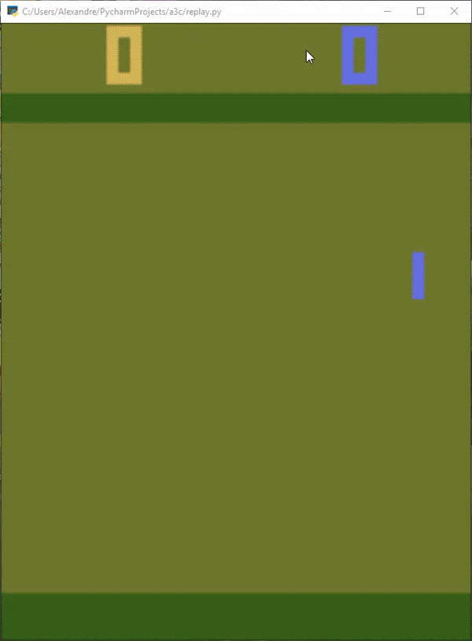

# A3C implementation on tensorflow

Implementation of Google’s DeepMind paper A3C.

I've had to use all of my knowledge of data structures, algorithms, and math, to be able to write code which used information from millions of pixels being streamed into convolutional neural networks, that were then used to teach multiple virtual agents to play Atari games through self play.

